# Les entités de Minecraft

## Les créatures de Minecraft

!!! info "Mobs pouvant être placé via un oeuf d'apparition ou déjà apparu sur le monde :"
    | Mobs hostiles | Images | Mobs passifs | Images | Mobs neutres | Images |
    |---------------|:----------------:|---------------|:---------------:|----------------|:---------------:|
    | Zombie | { width=60 } | Cheval | 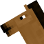{ width=60 } | Abeille | { width=60 } |
    | Zombie villageois | 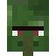{ width=60 } | Mule | 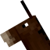{ width=60 } | Chèvre | 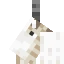{ width=60 } |
    | Zombie noyé | { width=60 } | Âne | { width=60 } | Dauphin | { width=60 } |
    | Zombie momifié | { width=60 } | Cheval-squelette | { width=60 } | Golem de fer | { width=60 } |
    | Zoglin | { width=60 } | Vache | { width=60 } | Lama | { width=60 } |
    | Wither squelette | 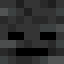{ width=60 } | Cochon | { width=60 } | Lama de Marchand | 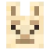{ width=60 } |
    | Wither squelette araignée | 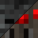{ width=60 } | Poule | 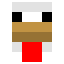{ width=60 } | Loup | 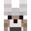{ width=60 } |
    | Vindicateur | { width=60 } |Mouton | 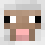{ width=60 } | Ours blanc | 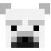{ width=60 } |
    | Vex | 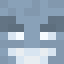{ width=60 } | Lapin | 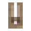{ width=60 } | Panda | 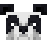{ width=60 } |
    | Vagabond | 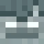{ width=60 } | Chat | { width=60 } | Piglin | 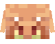{ width=60 } |
    | Squelette | { width=60 } | Chauve-souris | { width=60 } | Araignée | 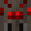{ width=60 } |
    | Sorcière | { width=60 } | Champimeuh | { width=40 } { width=40 } | Araignée venimeuse | { width=60 } |
    | Slime | { width=60 } | Perroquet | { width=60 } | Piglin zombifié | 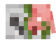{ width=60 } |
    | Shulker | { width=60 } | Renard | 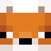{ width=40 } 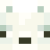{ width=40 } | Enderman | { width=60 } |
    | Ravageur | 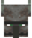{ width=60 } | Ocelot | 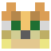{ width=60 } | Poisson-globe | { width=60 } |
    | Poulet chevauché | 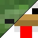{ width=60 } | Golem de neige | 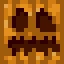{ width=60 } |
    | Poisson argent | { width=60 } | Arpenteur | { width=60 } |
    | Pillard | { width=60 } | Marchand ambulant | 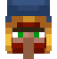{ width=60 } |
    | Piglin barbare | 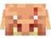{ width=60 } | Villageois | { width=60 } |
    | Phantom | { width=60 } | axolotl | { width=60 } |
    | Magma cube | { width=60 } | Poulpe | 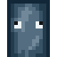{ width=60 } |
    | Hoglin | { width=60 } | Poulpe luisant | { width=60 } | 
    | Grand Gardien | 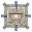{ width=60 } | Saumon | 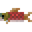{ width=60 } |
    | Ghast | { width=60 } | Morue | { width=60 } |
    | Gardien | { width=60 } | Tortue | { width=60 } |
    | Évocateur | 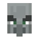{ width=60 } | Poisson tropical | { width=60 } |
    | Endermite | 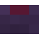{ width=60 } | Poisson-globe | 
    | Creeper | { width=60 } |
    | Cavalier squelette | { width=60 } |
    | Blaze | 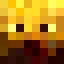{ width=60 } |
    | Araignée chevauchée | 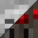{ width=60 } |

