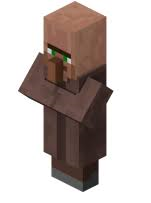

# Minecraft Skyblock

---

{ align=right }

## Description Minecraft

**Minecraft** est un jeu cubique à la fois jeu de _construction_ et d'_aventure_.  
Il y a donc devant nous deux possibilité:

- Le mode **"survie"** qui consiste à progresser dans le jeu en explorant les quatres coins du monde et en acquérant des "crafts" ( interface où l'on peut fabriquer des objets avec les ressources que l'on a ) qui permet d'avoir toutes les ressources du jeu. 

- Le mode **"créatif"**, qui comme l'indique est là où l'on peut créé une sorte de bac à sable où l'on peut faire toutes sortes de création et ainsi faire ressortir toute son imagination. 

> Deux principales versions du jeu :
>
>   - Minecraft Java Edition
>   - Minecraft Bedrock
     
!!! info "Les modes de Minecraft"
    Minecraft est consistué de deux modes, l'un est le mode _Solo_ où la personne crée son monde et doit survivre ou construire. Et puis nous avons le mode _Multijoueurs_[^multi] qui est donc le principe de jouer avec des joueurs en ligne. 
    Il suffit de se connecter à des "serveurs" en ligne de joueurs où se trouvent des mondes créé par d'autres joueurs. Et en effet dans ces serveurs nous pourrons alors retrouver des mini-jeux tels que le "_Bedwars_" ou encore le "_Skyblock_" !
    [^multi]: Ce mode est gratuit et facile d'accès, pour plus d'info :[Cliquez-ici](multijoueurs_infos.md)
     
    !!! faq "C'est quoi le Skyblock ?" 
        -Le skyblock d'où son nom en anglais "ciel" et "bloc". En effet le principe est de construire une ile dans le ciel à partir de "block" et en construisant toutes sortes de fermes/machines.
        

## Liste de quelques fermes/machines :

### Des fermes/machines à construction de blocks pour élargir son ile :

??? info "Construire les fermes/machines"
    Pour chaque ferme ou machine, si vous en trouvez une que vous aimez ou voudriez l'essayer, il suffit de cliquer sur l'image en question et cela vous amenera sur une vidéo où je vous montre comment la faire à l'aide d'un mod nommé "Latematica" (anciennement appelé Shematica) ou alors venant d'une vidéo youtube explicative.

!!! note "Des fermes à stone/cobblestone"
    Pour commencer un Skyblock il faut tout d'abord des blocks pour élargir son ile.  
    Pour ce faire nous avons la machine/ferme à cobblestone { width=30 } ou celle à stone { width=30 } , il en existe plusieurs :
    
    === "La ferme à cobblestone basique :"
        - Rapide et efficace en début de partie mais devient très vite encombrante et longue à casser. 
         
        - Dans la vidéo ci-dessous, je mets des dalles par-dessus la lave car sinon la lave risque d'enflammer des objets autour, tels que des tables de craft ou tous autres objets en bois.
    
        - Il est préférable de creuser un trou en-dessous de vous pendant que vous cassez la cobblestone pour miner dans le vide et ainsi ne pas détruire des blocks derrière l'emplacement de la cobblestone généré.

           

    === "Une autre ferme à stone/cobblestone :" 
        - Pas très longue à faire et ne demande pas énormément de ressources : 
        <iframe width="800" height="562" src="https://www.youtube.com/embed/rnC8DWM2a3g" title="YouTube video player" frameborder="0" allow="accelerometer; autoplay; clipboard-write; encrypted-media; gyroscope; picture-in-picture" allowfullscreen></iframe>   
         
    === "La ferme à stone en colonne :"
        - Demande plus de mécanique en redstone mais avec les indications vous pourrez vous en sortir.
        <iframe width="800" height="562" src="https://www.youtube.com/embed/OAh4CktKw_w" title="YouTube video player" frameborder="0" allow="accelerometer; autoplay; clipboard-write; encrypted-media; gyroscope; picture-in-picture" allowfullscreen></iframe>
     
    ???+ danger "Autre Ferme à stone/cobblestone"     
        Vous pourrez trouver une ferme à stone/cobblestone **énorme** et très **complexe**, attention cela est requis que pour ceux qui n'ont pas deux pieds gauche avec de la redstone.
        [Cliquez-ici]("listes_fermes_avancees.md")

### Des fermes/machines à minerais :

!!! note "Des fermes à fer"
    Dans un Skyblock il vous faudra à un moment ou un autre énormément de fer, pour cela il existe des Fermes à fer, le principe est simple, Mojang (ceux qui s'occupe du jeu Minecraft) ont fait un systeme dès lors où des pnjs[^pnj] { width=30 }sont avec des lits cela forme un village et alors il apparaitra un golem de fer { width=30 }. Ce golem de fer si il est tué laissera tombé du fer { width=30 } sur le sol ainsi qu'une coquelicot { width=30 }.

    1. Ferme à fer récente et fonctionnelle : [Ferme à fer](https://youtu.be/Pzdwd_oOBkE){ .md-button }

    2. Ferme à fer ancienne et dont la première de la vidéo que j'utilisais sur le serveur Play.Uni-Craft.fr : [Anciennes ferme à fer](https://youtu.be/YmTNyD5Gxi4){ .md-button }

    3. Ferme à fer dont j'ai aussi utilisé et qui fonctionne plutôt bien aussi : [Autre ferme à fer](https://youtu.be/yaPg9_cQb9U){ .md-button }
[^pnj]: Villageois

### Minerais/fermes à aquérir au plus vite pour bien débuter :

!!! info "Des fermes à savoir faire :"
    Chacune des fermes sont soit Auto[^ip] ou Semi-Auto[^Semi-Auto].
    
    [^pnj]: Villageois
    [^ip]: Automatique, donc la ferme en question n'a pas besoin d'assistance du joueur.
    [^Semi-Auto]: Semi-Automatique, donc la ferme en question a besoin d'assistance du joueur.
    
    | Entités | Fermes |  Semi-Auto | Auto |
    |----------|--------|:----------:|:----:|
    | Stone/cobblestone | Ferme à stone/cobblestone | ✅ | ⭕ |
    | Loot de monstres | Ferme à mobs | ⭕ | ✅ |
    | Lingot de fer | Ferme à fer | ⭕ | ✅ |
    | Bûche de bois | Ferme à bois | ✅ | ⭕ |
    | Pnj | Ferme à Pnj | ✅ | ⭕ |

Vous remarquerez le mot "**entité**" qui correspond à tous items (objets) ou des mobs (des monstres, des animaux, des villageois, et même les joueurs).
