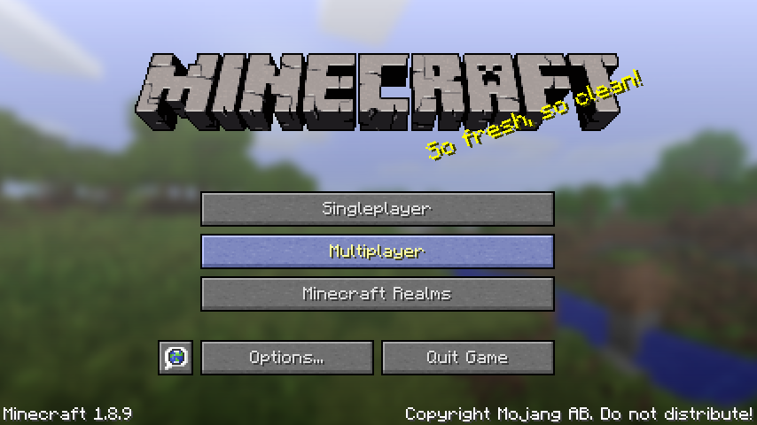
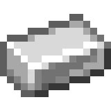
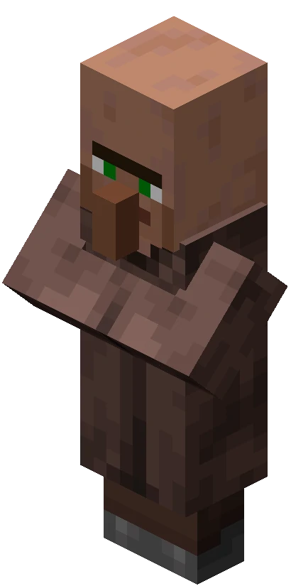
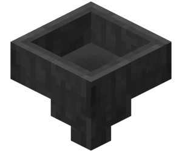
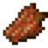
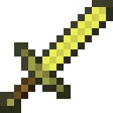
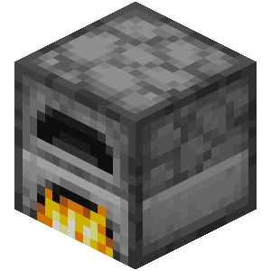

# Minecraft Skyblock

---

{ align=right }

## Description Minecraft

**Minecraft** est un jeu cubique à la fois Jeu de _construction_ et d'_aventure_.  
Il y a donc devant nous deux possibilitées:

- Le mode **"survie"** qui consiste à progresser dans le jeu en explorant les quatres coins du monde et en acquérant des "crafts" ( interface où l'on peut fabriquer des objets avec les ressources que l'on a, à partir d'une table de craft, "d'artisanat" ) qui permet d'avoir toutes les ressources du jeu. 

- Le mode **"créatif"**, est un monde ouvert comme un bac à sable qui permet de faire toutes sortes de création et ainsi faire ressortir toute son imagination. 

> Deux principales versions du jeu :
>
>   - Minecraft Java Edition
>   - Minecraft Bedrock
     
!!! info "Les modes de Minecraft"
    Minecraft est consistué de deux modes, l'un est le mode _Solo_ où la personne crée son monde et doit survivre ou construire. Et puis nous avons le mode _Multijoueurs_[^multi] qui est donc le principe de jouer avec des joueurs en ligne. 
    Il suffit de se connecter à des "serveurs" en ligne où se trouvent des mondes créé par d'autres joueurs. Et en effet dans ces serveurs nous pourrons alors retrouver des mini-jeux tels que le "_Bedwars_" ou encore le "_Skyblock_" !
    { width=350 }
    [^multi]: Ce mode est gratuit et facile d'accès, pour plus d'informations :[Cliquez-ici](multijoueurs_infos.md)
     
    !!! faq "C'est quoi le Skyblock ?" 
        -Le skyblock d'où son nom en anglais "ciel" et "bloc". En effet le principe est de construire une île dans un monde ouvert dans le ciel à partir de "blocs" où vous pourrez vous fixer toutes sortes d'objectifs comme construire des décos, être le plus riche et en construisant différentes fermes/machines pour exploiter d'autres ressources afin de vous fixer vos objectifs.
!!! faq "Eau et Lave infini ?"
    Pour avoir de l'eau { width=30 } à l'infini il vous suffit de placer de l'eau dans un trou de `2x2`, deux seaux d'eau { width=30 } aux deux extremités des diagonales.  
    Cela peut fonctionner aussi via une glace qui a été cassé seulement après avoir été posé aux extremités du trou.

    { width=250 }

    Il est possible d'avoir de la lave { width=30 } à l'infini, mais cela concerne les joueurs jouant à partir de la version 1.17 étant donné que les stalactiques sont apparues pour la première fois en 1.17 et { width=30 } qui ont permis aux joueurs d'avoir une source de lave infini dans l'overworld.  
    Il vous suffit d'avoir principalement une source de lave, un bloc de stalactique et un chaudron { width=30 } (il faut sept lingots de fer { width=30 } pour pouvoir craft un chaudron).

    { width=250 }

Je tiens à dire que ce tuto pour le skyblock est principalement pour la version Java.  
De plus je me penche plus sur le sujet des fermes/machines pour votre survie skyblock qui vous permettera d'acquerir plusieurs ressources notamment les principales comme le fer, le butin des monstres, et la cobblestone/stone.

    
        
## Minerais/fermes à aquérir au plus vite pour bien débuter :

!!! info "Des fermes à savoir faire :"
    Chacune des fermes sont soit Auto[^ip] ou Semi-Auto[^Semi-Auto].
    
    [^ip]: Automatique, donc la ferme en question n'a pas besoin d'assistance du joueur.
    [^Semi-Auto]: Semi-Automatique, donc la ferme en question a besoin d'assistance du joueur.
    
    | Entités | Fermes |  Semi-Auto | Auto |
    |----------|--------|:----------:|:----:|
    | Stone/cobblestone | Ferme à stone/cobblestone | ✅ | ⭕ |
    | Loot de monstres | Ferme à mobs | ⭕ | ✅ |
    | Lingot de fer | Ferme à fer | ⭕ | ✅ |
    | Bûche de bois | Ferme à bois | ✅ | ⭕ |
    | Pnj | Ferme à Pnj | ✅ | ⭕ |

Vous remarquerez le mot "**entité**" qui correspond à tous items (objets) ou des mobs (des monstres, des animaux, des villageois, et même les joueurs), pour en savoir plus :[Cliquez-ici](entites_minecraft.md)

## Liste de quelques fermes/machines :

### Des fermes/machines à construction de blocks pour élargir son ile :

??? info "Construire les fermes/machines"
    Pour chaque ferme ou machine, si vous en trouvez une que vous aimez ou voudriez l'essayer, il suffit de cliquer sur l'image en question et cela vous amenera sur une vidéo où je vous montre comment la faire à l'aide d'un mod nommé "Latematica" (anciennement appelé Shematica) ou alors venant d'une vidéo youtube explicative.

!!! info "Des fermes à stone/cobblestone"
    Pour commencer un Skyblock il faut tout d'abord des blocks pour élargir son ile.  
    Pour ce faire nous avons la machine/ferme à cobblestone { width=30 } ou celle à stone { width=30 } , il en existe plusieurs :
    
    === "La ferme à cobblestone basique :"
        - Rapide et efficace en début de partie mais devient très vite encombrante et longue à casser. 
         
        - Dans la vidéo ci-dessous, je mets des dalles par-dessus la lave car sinon la lave risque d'enflammer des objets autour, tels que des tables de craft ou tous autres objets en bois.
    
        - Il est préférable de creuser un trou en-dessous de vous pendant que vous cassez la cobblestone pour miner dans le vide et ainsi ne pas détruire des blocks derrière l'emplacement de la cobblestone généré.

           

    === "Une autre ferme à stone/cobblestone :" 
        - Pas très longue à faire et ne demande pas énormément de ressources : 
        <iframe width="800" height="562" src="https://www.youtube.com/embed/rnC8DWM2a3g" title="YouTube video player" frameborder="0" allow="accelerometer; autoplay; clipboard-write; encrypted-media; gyroscope; picture-in-picture" allowfullscreen></iframe>   
         
    === "La ferme à stone en colonne :"
        - Demande plus de mécanique en redstone mais avec les indications vous pourrez vous en sortir.
        <iframe width="800" height="562" src="https://www.youtube.com/embed/OAh4CktKw_w" title="YouTube video player" frameborder="0" allow="accelerometer; autoplay; clipboard-write; encrypted-media; gyroscope; picture-in-picture" allowfullscreen></iframe>
     
    ???+ danger "Autre Ferme à stone/cobblestone"     
        Vous pourrez trouver une ferme à stone/cobblestone **énorme** et très **complexe**, attention cela est requis pour ceux qui ont une grande habilité avec de la redstone.
        [Cliquez-ici](listes_fermes_avancees.md)

### Des fermes/machines à minerais :

!!! info "Des fermes à fer"
    Dans un Skyblock il vous faudra à un moment ou un autre énormément de fer, pour cela il existe des Fermes à fer, le principe est simple, Mojang (ceux qui s'occupe du jeu Minecraft) ont fait un systeme dès lors où des pnjs[^pnj] { width=30 }sont avec des lits cela forme un village et alors il apparaitra un golem de fer { width=30 }. Lorsqu'il est tué, il laissera tomber du fer  { width=30 } sur le sol ainsi qu'un coquelicot { width=30 }.

    1. Ferme à fer récente et fonctionnelle : [Ferme à fer](https://youtu.be/Pzdwd_oOBkE){ .md-button }

    2. Ferme à fer ancienne et dont la première de la vidéo que j'utilisais sur le serveur Play.Uni-Craft.fr : [Anciennes ferme à fer](https://youtu.be/YmTNyD5Gxi4){ .md-button }

    3. Ferme à fer dont j'ai aussi utilisé et qui fonctionne plutôt bien aussi : [Autre ferme à fer](https://youtu.be/yaPg9_cQb9U){ .md-button }
[^pnj]: Villageois

!!! info "Des fermes à or "
    L'or peut servir pour plusieurs choses : pour votre désir personnel d'être riche et vous sentir comme un vrai pirate avec votre trésor, mais plus concrètement pour vos outils et armures même si ce n'est pas le meilleur matériau en terme de vie mais c'est plutôt efficace sur une courte durée.  
    
    Puis vous pouvez faire de la nourriture dorée pour mieux saturer votre barre de nourriture { width=120 } :  
    Les carottes dorées qui sont trés utiles pour la saturation de votre barre de nourriture ou alors très connues les pommes dorées qui peuvent vous donner de la _Régénération_ II (0:05) et de l'_Absorption_ (2:00) qui sont très efficaces en combat.  
    Bien sûr ce n'est pas tout mais le reste des items à craft avec de l'or est moins utilisé . 
    
    !!! faq "Comment ça marche une ferme à or ?"
        Le principe de cette ferme est simple : vous devez mettre des portails du nether pour faire apparaître des piglins[^pigmens] qui tombent sous l'effet d'un bonhomme de neige qui tire sur un de ses compatriotes ( ou bien dans les nouvelles versions du jeu il y a les oeufs de tortue).  
        Cela le force alors à intervenir et chute ensuite dans une coulée d'eau pour finalement tomber dans un trou qui le condamne à une mort certaine.  
        
        Il vous restera juste à mettre des entonnoirs { width=30 } relier à des coffres { width=30 } pour récuperer son butin : des pépites d'or { width=30 } , quelques fois des lingots d'or { width=30 } , sa chair putrifié { width=30 } et une épée en or { width=30 } (ces objets sont aléatoires lors du ramassage du butin).
        [^pigmens]: Autrefois appelé "pigmens" si cette créature ne vous ai pas familier jetez un coup d'oeil [ici](entites_minecraft.md)

    Je vous présente un youtubeur français Aurelien_Sama { width=30 } qui fait plusieurs contenus sur Minecraft dont des nouveautés sur les mises à jour du jeu, des fermes/machines etc.  
    Je vous mets ci_dessous une de ses fermes à or :
    
    <iframe width="800" height="562" src="https://www.youtube.com/embed/Ug8TOAt0i8I" title="YouTube video player" frameborder="0" allow="accelerometer; autoplay; clipboard-write; encrypted-media; gyroscope; picture-in-picture" allowfullscreen></iframe>

    !!! note "La pomme de Notch "
        La pomme de Notch { width=30 } est le surnom de la pomme dorée enchantée du créateur de Minecraft. La pomme de Notch n'est pas fabriquable mais elle est possible à trouver dans les Donjons, les Manoirs, les Portails en ruine du nether, les Mines abandonées, les Temples du désert et les Vestiges de bastion.  
        
        Cependant elle était possible à fabriquer à la version 1.9 avec huits blocs d'or, les fermes à or étaient plus que bénéfiques pour avoir ces pommes dorées enchantées c'est la raison pour laquelle j'en parle içi.

    !!! tip "L'xp c'est quoi ?"
        L'xp, de son nom complet "expérience" se présente sous forme de petites boules de particules vertes { width=30 }. Elle s'obtient lorsque le joueur tue avec n'importe quels outils une créature ou alors en cuisant des objets dans un four { width=30 } et enfin par des fermes comme celle à or.  
        
        L'expérience se consomme très vite puisqu'elle sert à enchanter vos outils, armures mais aussi de les réparer, d'où la nécessité d'avoir une ferme qui vous en donne.
    !!! danger "Ferme à or complexe"
        Vous pouvez avoir des fermes à or beaucoup plus complexe comme par exemple une ferme du youtubeur Ilmango { width=30 } mais attention cela concerne les joueurs qui jouent à une version inférieur à la version 1.14 de Minecraft car un bug sur la rage des piglins sur le joueur a été fixé.[Cliquez-ici](listes_fermes_avancees.md)  
        Je vous conseille d'y jeter un oeil car le youtubeur ne s'arrête pas à la version 1.14 .