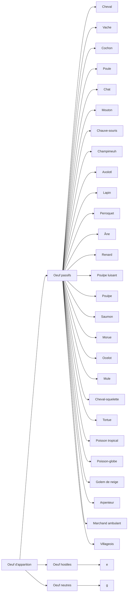

```mermaid

flowchart LR
    a[Oeuf d'apparition] --> c[Oeuf passifs]
    a --> b[Oeuf hostiles] 
    a --> d[Oeuf neutres]
    b --> e
    d --> g
    c --> 1[Cheval] 
    c --> 2[Vache]
    c --> 3[Cochon]
    c --> 4[Poule]
    c --> 5[Chat]
    c --> 6[Mouton]
    c --> 7[Chauve-souris]
    c --> 8[Champimeuh]
    c --> 9[Axolotl]
    c --> 10[Lapin]
    c --> 11[Perroquet]
    c --> 12[Âne]
    c --> 13[Renard]
    c --> 14[Poulpe luisant]
    c --> 15[Poulpe]
    c --> 16[Saumon]
    c --> 17[Morue]
    c --> 18[Ocelot]
    c --> 19[Mule]
    c --> 20[Cheval-squelette]
    c --> 21[Tortue]
    c --> 22[Poisson tropical]
    c --> 23[Poisson-globe]
    c --> 24[Golem de neige]
    c --> 25[Arpenteur]
    c --> 26[Marchand ambulant]
    c --> 27[Villageois]
    
```

