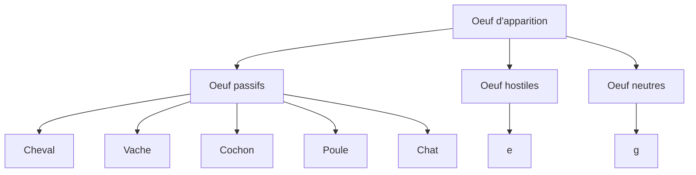

```mermaid

flowchart TB
    a[Oeuf d'apparition] --> c[Oeuf passifs]
    a --> b[Oeuf hostiles]
    a --> d[Oeuf neutres]
    b --> e
    d --> g
    c --> 1[Cheval]
    c --> 2[Vache]
    c --> 3[Cochon]
    c --> 4[Poule]
    c --> 5[Chat]

    
    
```